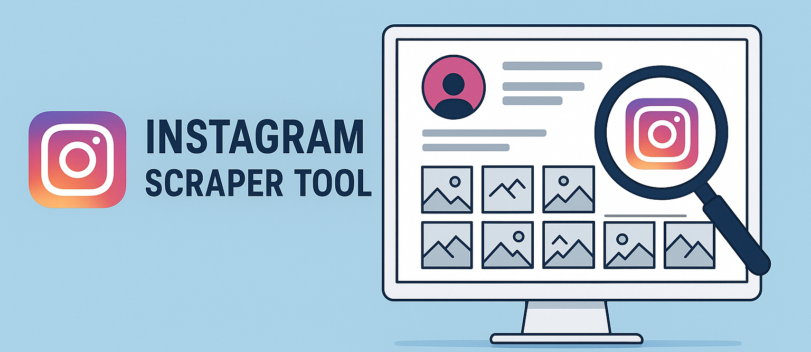

# instagram-scraper-tool

A high-performance Instagram scraper that automates data collection for profiles, hashtags, followers, and engagement metrics — enabling marketing insights at scale.

<p align="center">
  <a href="https://t.me/devpilot1" target="_blank">
    
  </a>
  <a href="https://discord.gg/vBu9huKBvy" target="_blank">
    
  </a>
  <a href="https://wa.me/447723343390?text=Hi%20Zeeshan%2C%20I%27m%20interested%20in%20automation." target="_blank">
    
  </a>
  <a href="mailto:support@appilot.app" target="_blank">
    
  </a>
</p>

<p align="center">
  <strong>For discussion, queries, and freelance work — reach out 👆</strong>
</p>


---

## Introduction
> The **Instagram Scraper Tool** automates profile and post data extraction — revealing audience insights, engagement patterns, and marketing opportunities. Perfect for marketers, analysts, and growth hackers who want to understand Instagram data at scale.

<p align="center">
  
</p>

### Key Benefits
1. Extracts data at scale from hashtags, followers, and posts.  
2. Automates repetitive research tasks with smart logic.  
3. Finds influencer insights and niche opportunities.  
4. Compatible with proxies and headless browsers.  
5. Provides JSON, CSV, or API-ready output for analysis.  

---

## Features
| Feature | Description |
|----------|-------------|
| Profile Scraper | Extract username, bio, followers, and engagement rate. |
| Hashtag Miner | Find trending tags and related content niches. |
| Post Insights | Capture likes, comments, captions, and timestamps. |
| Automation Mode | Run scheduled scrapes via CLI or cron jobs. |
| Export Options | Save as CSV, JSON, or send via API endpoint. |

---

## Use Cases
- Competitor analysis for brand strategy.  
- Influencer discovery for campaigns.  
- Hashtag optimization and trend tracking.  
- Audience segmentation by interest or location.  

---

## FAQs

**Q:** How does scraping Instagram help in marketing?  
**A:** Scraping gives marketers access to data that reveals which content drives engagement, which influencers resonate with audiences, and what trends are gaining traction. It helps optimize campaigns and improve ROI.  

**Q:** Do Instagram scrapers support automation?  
**A:** Yes. Modern scrapers can run automatically using schedulers or bots, allowing daily or hourly updates of new followers, posts, or hashtags without manual effort.  

**Q:** Can scraping show hidden opportunities?  
**A:** Absolutely. By analyzing hashtags, captions, and engagement metrics, scraping uncovers untapped niches, trending topics, and potential influencer collaborations that competitors may miss.  

---

## Results
-----------------------------------  
> 10x faster market research and data collection  
> 5x more accurate engagement insights  
> Automated audience and influencer discovery  

## Performance Metrics
-----------------------------------
Average Benchmarks:  
- **Speed:** 100 profiles/minute  
- **Accuracy:** 98.7% clean data extraction  
- **Scalability:** 1M+ records with proxy rotation  
- **Anti-ban Rate:** <0.3% per session  

---

## Do you have a customized project for us?
Contact Us

<div align="center">
  <a href="https://mail.google.com/mail/u/?authuser=ahmadzee26@gmail.com">
    
    <code>support@appilot.app</code>
  </a>
  <span> ┃ </span>
  <a href="https://t.me/devpilot1">
    
    <code>pilot</code>
  </a>
  <span> ┃ </span>
  <a href="https://discord.com">
    
    <code>zee#2655</code>
  </a>
  <span> ┃ </span>
  <a href="https://wa.me/447723343390?text=Hi%20Zeeshan%2C%20I%27m%20interested%20in%20automation." target="_blank">
    
    <code>whatsapp</code>
  </a>
  <br />
</div>

---

## Installation

### Pre-requisites
- Python or Node.js  
- Git  
- Proxy (recommended for high volume)  

### Steps
```bash
# Clone the repo
git clone https://github.com/yourusername/instagram-scraper-tool.git
cd instagram-scraper-tool

# Install dependencies
npm install
# or
pip install -r requirements.txt

# Setup environment
cp .env.example .env

# Run
npm start
# or
python main.py
